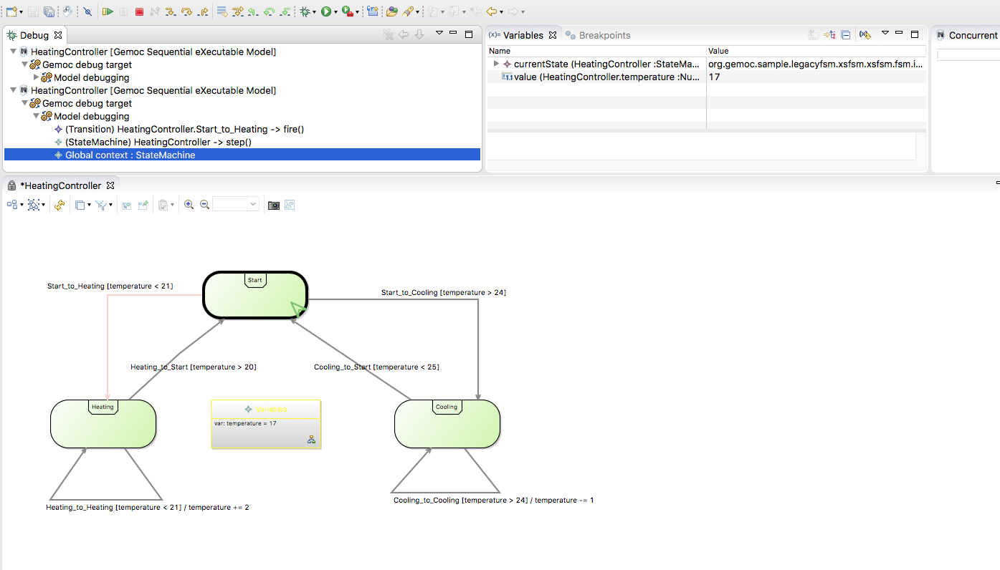
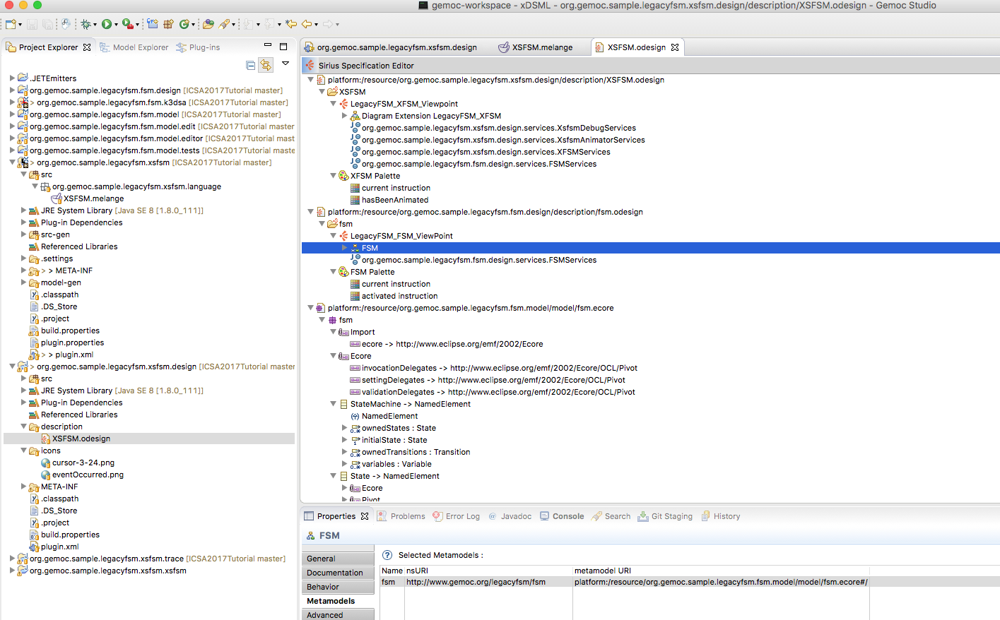
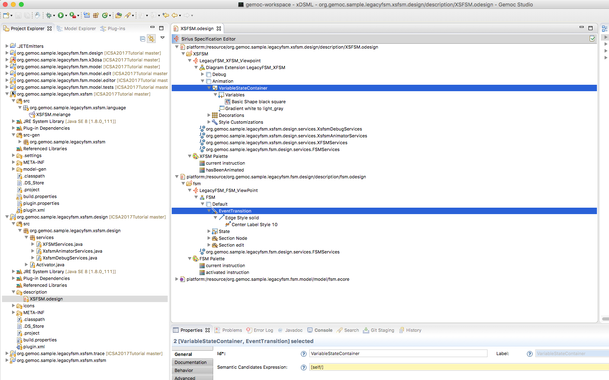
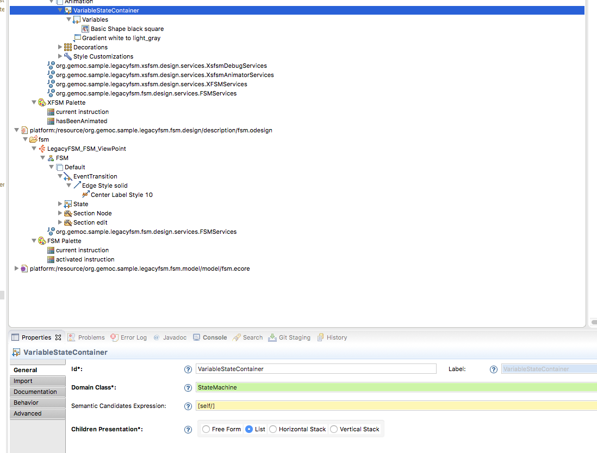
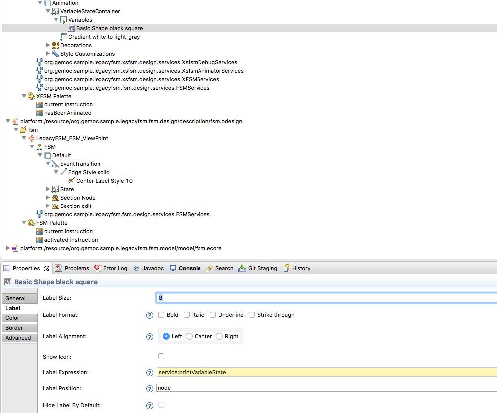

# ICSA Tutorial

* [Scope](#scope)
* [Program](#program)
* [Materials](#materials)


This tutorial provides a practical approach for developing and integrating various Domain-Specific (modeling) Languages (DSLs) used in the development of modern complex software-intensive systems, with the main objective to support abstraction and separation of concerns. This tutorial leverages the tooling provided by the GEMOC studio to present the various facilities offered by the Eclipse platform (incl., EMF/Ecore, Sirius) and introduces the advanced features to extend a DSL with a well-defined execution semantics. From such a specification, we demonstrate the ability of the studio to automatically support model execution, graphical animation, omniscient debugging, concurrency analysis and concurrent execution of heterogeneous models. The tutorial is composed of both lectures and hands-on sessions. Hands-on sessions allow participants to experiment on a concrete use case of an architecture description language used to coordinate heterogeneous behavioral and structural components.


## Scope

During this tutorial, the participants will extend a given finite state machine DSL in terms of syntax and semantics and integrate it into a simplified version of the [MontiArc component & connector ADL](http://www.se-rwth.de/topics/Software-Architecture.php) using the GEMOC Studio language workbench. The ADL is tailored for designing component-based distributed interactive systems that reliy on state-based models to describe component behavior. In the modeling workbench, the participants will design integrated models. Based on such a design, participants will be able to concurrently execute the various components according to the execution semantics (message passing) of MontiArc, to graphically animate the architecture, and to debug the system behavior.


## Legend

* ⚠️ Read carefully, tricky details follow,
* ​:no_entry: Breaking changes. You should download a new version of the language under development for temopral reasons. You may proceed with you local changes, but we might not be able to support its evolution tue to the short time frame of the tutorial. 


## Program

- [Part 1. General introduction](#part-1-general-introduction)
- [Part 2. Building a simple finite state machine language for specifying your component behavior](#part-2-building-a-simple-finite-state-machine-language-for-specifying-your-component-behavior)
  - [2.1 Running the FSM example](#21-running-the-fsm-example)
  - [2.2 Adding new concepts to your language](#22-adding-new-concepts-to-your-language)
  - [2.3 Completing the dynamic semantics](#23-completing-the-dynamic-semantics)
  - [2.4 Defining concrete syntax with Sirius](#24-defining-concrete-syntax-with-sirius)
  - [2.5 Composing languages](#25-composing-languages)
- [Part 3. Wrap-up and discussion](#part-3-wrap-up-and-discussion)


## Materials

- The latest [GEMOC Studio](http://gemoc.org/studio.html) and provide a [Java 1.8 JDK](http://www.oracle.com/technetwork/java/javase/downloads/jdk8-downloads-2133151.html) and clone the [tutorial's repository](https://github.com/gemoc/ICSA2017Tutorial.git) or use the virtualbox VM TODO
- The slides for the tutorials are available on [here](https://github.com/gemoc/ICSA2017Tutorial/blob/master/slides/tutorial-slides.pptx).
- Most of the documentation on GEMOC approches are available [here](http://GEMOC.org/GEMOC-studio/publish/guide/html_single/Guide.html).
- Documentation of MontiArc's [structural](http://www.se-rwth.de/publications/MontiArc-Architectural-Modeling-of-Interactive-Distributed-and-Cyber-Physical-Systems.pdf) and [behavioral](http://www.se-rwth.de/publications/Architecture-and-Behavior-Modeling-of-Cyber-Physical-Systems-with-MontiArcAutomaton.pdf) features is available as well.


You can refer to the documentation at any time.


## Part 1. General introduction

This part introduces the structure and goals of the tutorial. Moverover it covers an introduction to software language engineering, GEMOC Studio and the GEMOC initiative. The slides are available [here](https://github.com/gemoc/ICSA2017Tutorial/blob/master/slides/tutorial-slides.pptx).


## Part 2. Language engineering

In this part, you will - due to temporal restrictions - extend the metamodel and semantics of a language for finite state machines (FSM) that ultimately will be integrated in the MontiArc component & connector ADL. In the first step, you will load the projects implementing the language into the language workbench, start the modeling workbench, and execute/debug an FSM. Afterwards, you will extend the metamodel of the FSM language with three new concepts related to FSM variables and their usage. Then you will add behavior of these new concepts to the language. After that, you switch to the MontiArc language and add new concrete (graphical) syntax to it, before you integrate FSM into MontiArc, combine theri behavior, and execute the result.


### 2.1 Running the FSM example

- Open your GEMOC Studio
- Go to a new workspace.
- Go to File -> new -> Example -> Select GEMOC FSM Language (Sequential)


This produces the general structure of a (x)DSL project, which comprises the projects for your static language (projects org.gemoc.sample.legacyfsm.fsm.*) 

-  org.gemoc.sample.legacyfsm.fsm.model Contains the metamodel of your language 
-  org.gemoc.sample.legacyfsm.fsm.model.edit Contains the metamodel helper classes of your metamodel mainly Observer and Visitor Pattern  
-  org.gemoc.sample.legacyfsm.fsm.model.editor Generate a generic tree based editor for your FSM Model 
-  org.gemoc.sample.legacyfsm.fsm Contains the DSL description melange file for your FSM language 
-  org.gemoc.sample.legacyfsm.fsm.design Contains a graphical representation desciption for you FSM model Sirius based  


and their executable counterparts (projects org.gemoc.sample.legacyfsm.xsfsm.*)

- org.gemoc.sample.legacyfsm.xsfsm Contains the DSL description melange file for your XSFSM language 
- org.gemoc.sample.legacyfsm.xsfsm.design Contains graphical representation extension for you XSFSM model Sirius Animator  
- org.gemoc.sample.legacyfsm.xsfsm.trace Contains the generated project for efficient executable trace management 
- org.gemoc.sample.legacyfsm.xsfsm.xsfsm Generated executable FSM metamodel resulting from the org.gemoc.sample.legacyfsm.xsfsm language specification melange file


#### Playing with the language

1. Start a modelling workbench

   

   ​

2. Get the example for (GEMOC model for FSM Sequential)

   

- Open the bitshifting.aird file: there you can see and edit the FSM model.

Next: Run this model. To this effect, open the *run* dialog:

- Run in **debug mode** the **BitShifting.fsm 000101010** run configuration.

You then can play with the debug model by stepping through it and observing the state transitions.


​:warning: You can now close the modelling workbench


### 2.2 Adding new concepts to your language

Just open your FSM metamodel (in project org.gemoc.sample.legacyfsm.fsm.model) in the language workbench either using the graphical editor via fsm.aird or using the tree-based editor via fs.ecore. 


1. Add the concept of `Variable` that has a name to the FSM. Add the subclasses : a `StringVariable`, `BooleanVariable`, and a `NumberVariable`as depicted below:


2. Add the concepts of Guards and Actions to the Transition as depicted below


​:warning: At the end of this task, you must regenerate the Java code for your metamodel. Right click on the *fsm.genmodel* in the same folder as the metamodel and select reload. Next open it and in the tree editor, right click and select *generate all*.


#### Adding OCL constraints

⛔ The result of the previous step is available from the [folder 2.2](https://github.com/gemoc/ICSA2017Tutorial/tree/master/code/2.2). Please download it if you encountered problems in adding the new concepts to the FSM metamodel.

In our language, you can define your static semantics (i.e., well-formedness rules) using OCL. Let us try to define that a state cannot have two outgoing transitions without a guard. To this effect, open the metamodel with the *OCLinEcore editor* via right clicking it and selecting that editor. Here, you can create an `invariant` for the concept `State`that restricts its outgoing transitions.

+ The official OCL documentation is [available online](http://download.eclipse.org/ocl/doc/5.0.0/ocl.pdf) as well as there is a comprehensive [set of slides on it](https://de.slideshare.net/EdWillink/enrich-your-models-with-ocl).
+ A tutorial on the OCLinEcore editor is available from the [eclipse wiki](https://wiki.eclipse.org/OCL/OCLinEcore) and a getting started guide is available from the [eclipse help website](http://help.eclipse.org/neon/index.jsp?topic=%2Forg.eclipse.ocl.doc%2Fhelp%2FGettingStarted.html).

##### Example: Invariant to check uniqueness of names

```OCL
invariant uniqueStateNames: 
	self.states->forAll(s1, s2| s1 <> s2 implies s1.name <> s2.name);
```

After creating the *invariant* for the *State* concept, start the modeling workbench again and open the **BitShifting** model again. Right click on it and select validate. Now eclipse marks all states as erroneous as none uses a guarded transition.


### 2.3 Completing the dynamic semantics

⛔ For temporal constraints, we provide an implementation of the FSM dynamic semantics. We suggest, to restart from the FSM version in the [folder 2.3](https://github.com/gemoc/ICSA2017Tutorial/tree/master/code/2.3). Prior to that, delete all projects from your workspace. 

The operational semantics of FSM are defined in the following Xtend file, which employs Kermeta and the [Interpreter Design Pattern](https://en.wikipedia.org/wiki/Interpreter_pattern) to describe the dynamic behavior of FM models: 

- org.gemoc.sample.legacyfsm.fsm.k3dsa/src/org/gemoc/sample/legacyfsm/fsm/k3dsa/tfsmAspects.xtend, 

We left two methods unimplemented with "TODO". Try to implement these two methods.

**Execution Functions**

The Execution Functions define how the Execution Data evolve during the execution of the model. Execution Functions can be implemented by defining the body of a method. These methods must be annotated with the **@Part** annotation. Whenever a method with an @Part annotation returns, the changes in the model will be applied (via a transaction) to the resource. This means that the changes will be visible from an animator. K3 supports nested @Part annotation calls so that changes in the model will be applied when entering and leaving methods having this annotations.

**Entry Points**

The GEMOC sequential engines uses methods annotated with **@Main** as entry points to model execution. This annotation must be placed on operations applicable to the root model element.

After finishing, run "generate all" on the Melange model of project org.gemoc.sample.legacyfsm.xsfsm, which generates a new language implementation.


Note how Melange has woven the methods defined in the aspects into the XSFSM metamodel defined in XSFSM.melange of org.gemoc.sample.legacyfsm.xsfsm.


#### Testing the execution of the model with its new semantics

⛔ The solution of the previous step is available from the [folder 2.4](https://github.com/gemoc/ICSA2017Tutorial/tree/master/code/2.4). Please download it and let's run the modelling workbench on top of these projects.

Create a FSM model with two steps and one transition. Create a variable `a` with `1` as an initial step. Create a guard associated to the transition that checks whether `a == 1`.  Create an action that assigns `2` to the variable `a`.


Let's debug this model!

1. Create the debug configuration


2. You can then debug your language


### 2.4: Defining concrete syntax with Sirius

In this step, you will define the grapical concrete syntax for a specific modeling element of the MontiArc language using the [Sirius](https://www.eclipse.org/sirius/doc/specifier/diagrams/Diagrams.html) framework. For temporal restrictions, we have prepared the state of FSM so far in the folder [2.4-sirius-start](https://github.com/gemoc/ICSA2017Tutorial/tree/master/code/2.4-sirius-start). Please remove your projects from the workspace and import the proejcts from this folder.  

As you have added variables, guard, and actions to the metamodel, these should be rendered also. The following figures shows the intended result in action. Transitions display guards and actions, the FSM has a container displaying the current variables values, and the currently touched elements are highlighted during execution.



In description/XSFSM.odesign of project org.gemoc.sample.legacyfsm.xsfsm.design, you'll find the Sirius designer model that renders the conrete graphical syntax of your language in the modelling workbench. This designer model is connected to you metamodel as depicted below:



This designer model comprises three views: a default view that renders the structural parts of your models, a debug view that overlays the structural parts with information from the debugging process (such as variable values), and an animator view that enables adding domain-specific animations.

- For rendering guards and actions, please adjust the labels of transitions accordingly. To this effect, investigate how the properties of "Event Transition" are mapped to methods of the class `XFSMServices`and adjust the employed methods accordingly.
- For the variables, we want to display their current values. To this end, create a container for variables in the animation view that can contain variables which are represented by labels as depicted by the next three figures.



The container for variables with its properties:



The node for variables with its properties:


The label rendering inforamtion of variables with its properties:



The label receives its text from the registered services. Depending on the view, the services render either the variables' initial values (default view) or their current values (debugging view). Please have a look at the classes `FSMServices` and `XFSMServices` and investigate how this is achieved.


XXXXXXXXXXXXXXXXXXXXXXXXXXXXXXXXXXXXXXXXXXXXXXXXXXXXXXXXXXXXXXXXXXXXXXXXXXXXXXXXXXXXXXXXXXXXXXXXXXXXXXXXXXXXXXXXXXXXXXXXXXXXXXXXXXXXXXXXXXXXXXXXXXXXXXXXXXXXXXXXXXXXXXXXXXXXXXXXXXXXXXXXXXXXXXXXXXXXXXXXXXXXXXXXXXXXXXXXXXXXXX

Let us import an example model from the project [ICSA2017Example](https://github.com/awortmann/xmontiarc/tree/icsa2017tutorial/ICSA2017Example) to understand the current diagram specification in the modelling workbench. In this project, open the file */bumperbot/BumperBot.aird* and in the project explorer, open the BumperBot diagram. See below:


In the modelling workbench, let us also import the project *ur1.diverse.xmontiarc.design*, which is the Sirius editor for MontiArc. The good thing is that the odesign models of Sirius projects are interpreted, hence you can modify the odesign diagram specification and just reload the diagram to see the impact.


Sirius is organized to query the model and create representation from the results of the queries. To draw the connector, we have to find each couple of ports between which the connector must be drawn.

Let us create an element based edge: On the default Viewpoint, create a new Element based Edge.  You can customize the style. Next you have to specify the query. In our case, all the `IntermediateConnector` instances have a source and a target and we map the border of the source and the border of the target. Finding the source and the target can be done using Java and AQL. We propose to use Java.


Next, we have to create the action to do when we draw a new `IntermediateConnector` between port. To this end, in section *Edge Section Connector* in the odesign, create a new Edge Creation.


This node gives you five subelements. Four that define the `source` and the `target` model elements pointed by your edge, the `source view`and the `target view` pointed by your edge. Also, it defines the action to execute when creating this edge. Basically, we will change the execution context for this action, create two variable and call an external Java action already define. The source code of this action is the following.


```Java
package ur1.diverse.xmontiarc.design;

import java.io.IOException;
import java.util.Collection;
import java.util.Map;

import org.eclipse.emf.ecore.EObject;
import org.eclipse.sirius.business.api.action.AbstractExternalJavaAction;
import org.eclipse.sirius.tools.api.ui.IExternalJavaAction;

import ur1.diverse.xmontiarc.xdsml.xmontiarc.xmontiarc.ComponentType;
import ur1.diverse.xmontiarc.xdsml.xmontiarc.xmontiarc.IncomingPort;
import ur1.diverse.xmontiarc.xdsml.xmontiarc.xmontiarc.IntermediateConnector;
import ur1.diverse.xmontiarc.xdsml.xmontiarc.xmontiarc.OutgoingPort;
import ur1.diverse.xmontiarc.xdsml.xmontiarc.xmontiarc.Subcomponent;
import ur1.diverse.xmontiarc.xdsml.xmontiarc.xmontiarc.XmontiarcFactory;

public class CreateIntermediateConnectorAction extends AbstractExternalJavaAction implements IExternalJavaAction {

	@Override
	public boolean canExecute(Collection<? extends EObject> arg0) {
		return true; // we can always add IntermediateConnector instances
	}

	@Override
	public void execute(Collection<? extends EObject> args, Map<String, Object> options) {
        // Load information from arguments
		OutgoingPort subcomponentOut = (OutgoingPort) options.get("source");
		IncomingPort subcomponentIn = (IncomingPort) options.get("target");
		Subcomponent sourceSubcomponent = (Subcomponent) options.get("sourceSubcomponent");
        // Identify containing component type
		ComponentType type = sourceSubcomponent.getParent();
        // New connector
		IntermediateConnector con = XmontiarcFactory.eINSTANCE.createIntermediateConnector();
		con.setSource(subcomponentOut);
		con.setTarget(subcomponentIn);
        // Add connector to component type 
		type.getConnectors().add(con);
		try {
			type.eResource().save(null); // Save model
		} catch (IOException e) {
			e.printStackTrace();
		}
		System.out.println("Connectors '" + type.getConnectors() + "'.");
	}

}
```

You can see in the next figures, the different configuration for these elements.


Please refer to the [Sirius documentation](https://www.eclipse.org/sirius/doc/specifier/diagrams/Diagrams.html) for learning and you can configure in details your editor.


### 2.5 Composing languages

⛔ This step is the most elaborate part of the tutorial. We aim to create a new language by composing our FSM with the XMontiArc metamodel. To this end, we will use Melange, which lets you create a language by composing several sublanguages.  We provide an improved version of the FSM language as well as the XMontiArc language to you. Please note that this is a **breaking change**. To continue, please ensure you have  the following projects in your workspace, which are available from the [icsa2017 branch of the xmontiarc github repository](https://github.com/awortmann/xmontiarc/tree/icsa2017tutorial).

+ TODO: Which projects are required and what are they used for?

The final project structure is as depicted below: TODO: update


TODO: Update project names and Melange model in the following

The quintessential artifact for integrating FSM and MontiArc is the melange model of ur1.diverse.xmontiarc.xdsml.withautomaton, which defines the two *external* languages (i.e., behaviorless languages that are considered legacy and to be reused as provided) FSM (ll. 5-8) and MontiArc (ll. 14-17). On top of these languages, it defines the executable languages XSFSM (ll. 10-12) and XMontiArc (ll. 19-24) by weaving the provided aspects into the legacy langages. Ultimately, it defines the XMontiArcWithAutomaton language (ll. 26-28) that merges the *StateMachine* concept of XSFSM into XMontiArc.

```Java
package ur1.diverse.xmontiarcwithautomaton.xdsml

import org.gemoc.sample.legacyfsm.fsm.k3dsa.*

external language FSM { 
    syntax "platform:/resource/org.gemoc.sample.legacyfsm.fsm.model/model/fsm.ecore"
}

language XSFSM inherits FSM {
	with org.gemoc.sample.legacyfsm.fsm.k3dsa.*
}

external language MontiArc { 
    syntax "platform:/resource/ur1.diverse.xmontiarc.model/ur1.diverse.xmontiarc.model/xmontiarc.ecore" 
    withGenmodel "platform:/resource/ur1.diverse.xmontiarc.model/ur1.diverse.xmontiarc.model/xmontiarc.genmodel" 
} 

language XMontiArc inherits MontiArc {  
	with ur1.diverse.xmontiarc.k3dsa.xmontiarc.aspects.PortAspect
	with ur1.diverse.xmontiarc.k3dsa.xmontiarc.aspects.SubcomponentAspect
	with ur1.diverse.xmontiarc.k3dsa.xmontiarc.aspects.ComponentTypeAspect
	with ur1.diverse.xmontiarc.k3dsa.xmontiarc.aspects.ConnectorAspect
}

language XMontiArcWithAutomaton inherits XMontiArc{
	merge XSFSM renaming 
    	{"fsm" to "xmontiarc" {"StateMachine" to "AutomatonComponentBehavior" }}
}
```

It remains to create glue code for the semantics. Lets do that together!

To create the glue between port automata (our improved version of FSM) and XMontiArc, we must ensure that messages passed to components via incoming ports are 'forwarded' to the component's embedded automaton (if any).  To this effect, we'll write the values of incoming ports to automaton variables of the same name. This automaton then performs a single step in which it may fire up to a single transition. Afterwards, the updated automaton variables are propagated to the ports again and send by the containing component.

We therefore must specify corresponding behavior in the… TODO

## Part 3. Wrap-up and discussion

See slides.